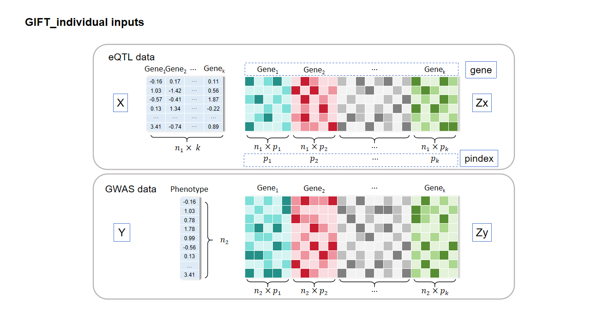
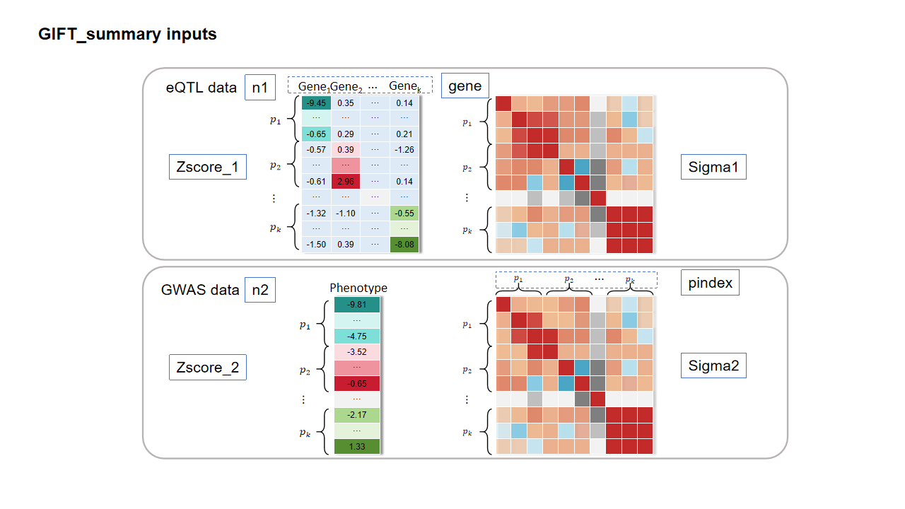
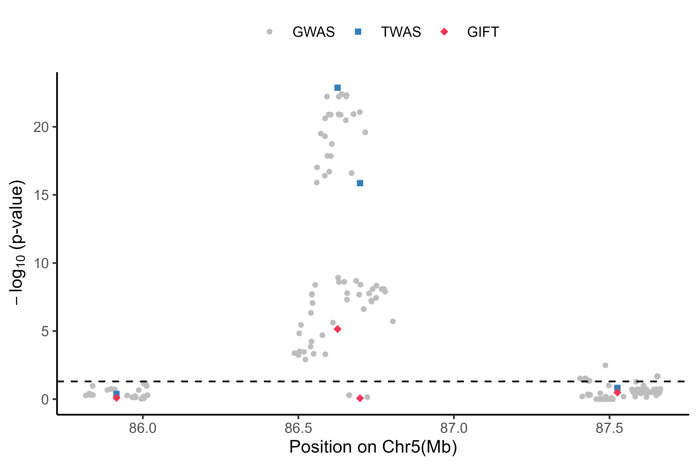
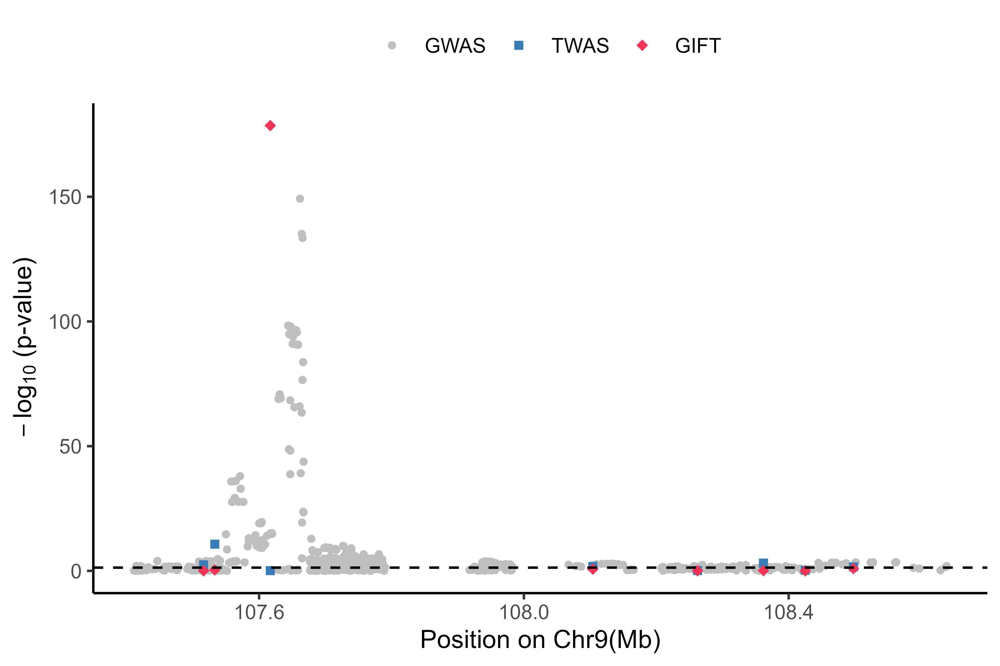

GIFT examines one genomic region at a time, explicitly models the gene expression correlation and cis-SNP LD across different genes in the focal region and accounts for the uncertainty in the constructed GReX, and carries out TWAS conditional analysis in a maximum likelihood framework. This tutorial is the example analysis with GIFT. Before running the tutorial, make sure that the GIFT package is successfully installed. Please see the [link](https://yuanzhongshang.github.io/GIFT/documentation/02_installation.html) for the installation instructions. The example data for the tutorial can be downloaded in this [page](https://yuanzhongshang.github.io/GIFT/documentation/03_data.html).

## A simulated data example
We conducted the simulations based on the realistic genotypes from GEUVADIS (n1=465) and UK Biobank (n2=5,000) in a region on chr 5. This region includes four genes: RASA1, COX7C, CCNH and TMEM161B. We set RASA1 as the causal gene with the effect size being sqrt(0.1).

### GIFT: Using individual-level data as input
The function `GIFT_individual` is the main function for GIFT with individual-level data. The essential inputs are:
- X: The standardized gene expression matrix for all genes in a specific region from eQTL data.
- Y: The standardized trait vector from GWAS data.
- Zx: The standardized cis-genotype matrix for all genes in a specific region from eQTL data. The columns represent the stacked genotypes of cis-SNPs for each gene.
- Zy: The standardized cis-genotype matrix for all genes in a specific region from GWAS data. The columns represent the stacked genotypes of cis-SNPs for each gene.
- gene: The gene name vector represents the genes in a specific region, the order of the gene name should be consistent with that in X.
- pindex: A vector with each element representing the number of cis-SNPs for each gene.


The optional inputs are:
- maxiter: The user-defined maximum iteration, with the default to be 100.
- tol: The user-defined convergence tolerance of the absolute value of the difference between the nth and (n+1)th log likelihood, with the default value as 1e-3.
- pleio: The user-defined option of controlling the pleiotropy, with the default to be 0. If 'pleio' is set to 0, the analysis will be performed without controlling any SNP; If 'pleio' is set to 1, the analysis will be performed controlling the top SNP; If 'pleio' is set to 2, the analysis will be performed controlling the top two SNPs. 
- ncores: The number of cores used in analysis, with the default to be 1. The analysis will be performed with parallel computing once the number of cores is greater than 1. Of note, the incorporated function mclapply() depends on another R package "parallel" in Linux. 
- filter: The user-defined logical value, with the default to be T. If 'filter' is set to T, the analysis will be performed using the SNPs with a GWAS p-value < 0.05 when the GWAS sample size over 100,000. This step will improve the computational speed.

#### Step 1: Pre-process the genotype data with different formats.
The function `pre_process_individual` is able to convert different genotype data formats to GIFT inputs. In particular, this function is flexible to handle plink binary format (.bim/.fam./.bed), vcf, ped/map format, csv, and tsv file. Here, we take various genotype data formats from GEUVADIS data in [page](https://yuanzhongshang.github.io/GIFT/documentation/03_data.html) for example. Of note, in this step, cis-genotype matrix has been standardized to have a mean of zero and standard derivation of one. 
```r
library(GIFT)
dir <- getwd()
#### load the directory containing the files to be processed only (e.g., plink binary format)
filelocation <- paste0(dir,"/example/simulation/individual/pre_process/plink_binary")
#### load the directory of plink exe file
plinkexe <- "plink"
#### pre-process the file to be a list including gene names vector, cis-genotype matrix and pindex
convert <- pre_process_individual(filelocation, plinkexe)
gene <- convert$gene
Zx <- convert$Z
pindex <- convert$pindex
```

#### Step 2: Read other datasets.
The required example data can be downloaded in this [page](https://yuanzhongshang.github.io/GIFT/documentation/03_data.html). 
```r
#### load the RData file containing X, Zy and Y
load(paste0(dir, "/example/simulation/individual/individual_data.RData"))
```

#### Step 3: Perform conditional fine-mapping for TWAS analysis.
```r
result <- GIFT_individual(X, Y, Zx, Zy, gene, pindex, maxiter=100, tol=1e-3, pleio=0, ncores=1, filter=T)
```
The result is a data frame including the causal effect estimates and p values for each gene within a focal region. 
```r
result
      gene causal_effect            p
1     CCNH    0.01393691 8.567936e-01
2    COX7C    0.02137385 8.030216e-01
3    RASA1    0.35142810 7.122607e-06
4 TMEM161B   -0.03313658 3.256314e-01
```
Indeed, horizontal pleiotropy occurs when SNPs affect the trait of interest through pathways other than or in addition to the gene and is partical important to control for as it is widespread in TWAS
applications. Here, we used 'pleio' in the function to control the pleiotropic effects of the top one/two SNPs in a focal region.
```r
#### control the top SNP
result <- GIFT_individual(X, Y, Zx, Zy, gene, pindex, maxiter=100, tol=1e-3, pleio=1, ncores=1, filter=T)
      gene causal_effect            p
1     CCNH    0.01499428 8.456540e-01
2    COX7C    0.02163585 8.018316e-01
3    RASA1    0.35421252 6.862475e-06
4 TMEM161B   -0.03312626 3.252345e-01

#### control the top two SNPs
result <- GIFT_individual(X, Y, Zx, Zy, gene, pindex, maxiter=100, tol=1e-3, pleio=2, ncores=1, filter=T)
result
      gene causal_effect            p
1     CCNH    0.04643412 1.000000e+00
2    COX7C    0.01620005 7.646110e-01
3    RASA1    0.32028143 2.115897e-06
4 TMEM161B   -0.03371455 3.059351e-01
```

### GIFT: Using summary statistics as input
The function `GIFT_summary` is the main function for GIFT with summary statistics. The essential inputs are:
- Zscore_1: Zscore matrix of the cis-SNP effect size for all genes in a specific region from eQTL data. The rows represent the z-scores of stacked cis-SNPs for all genes. If you only have the cis-eQTL summary statistics, you can directly set the value in the blue boxes to be zero in the figure below.
- Zscore_2: Zscore vector of the cis-SNP effect size for all genes in a specific region from GWAS data. The rows represent the z-scores of stacked cis-SNPs for all genes.
- Sigma1: LD matrix from eQTL data.
- Sigma2: LD matrix from GWAS data, both Sigma1 and Sigma2 are often from the same reference panel.
- n1: Sample size of eQTL data.
- n2: Sample size of GWAS data.
- gene: The gene name vector, the order of the gene name should be consistent with that in Zscore_1.
- pindex: A vector with each element represents the number of cis-SNPs for each gene.


The optional inputs are:
- R: Estimated correlation matrix of gene expressions, with the default to be an identity matrix.
- maxiter: The user-defined maximum iteration, with the default to be 100.
- tol: The user-defined convergence tolerance of the absolute value of the difference between the nth and (n+1)th log likelihood, with the default value as 1e-3.
- pleio: The user-defined option of controlling the pleiotropy, with the default to be 0. If 'pleio' is set to 0, the analysis will be performed without controlling any SNP; If 'pleio' is set to 1, the analysis will be performed controlling the top SNP; If 'pleio' is set to 2, the analysis will be performed controlling the top two SNPs. 
- ncores: The number of cores used in analysis, with the default to be 1. The analysis will be performed with parallel computing once the number of cores is greater than 1. If you use the Windows system, foreach() depends on another R package "doParallel" would be used. Otherwise, mclapply() depends on another R package "parallel" would be used.
- in_sample_LD: A logical value represents whether in-sample LD was used, with the default to be F. If in-sample LD was not used, the LD matrix is regularized to be (1-s1)\*Sigma1+s1\*E and (1-s2)\*Sigma2+s2\*E where both s1 and s2 are estimated by function estimate_s_rss() in susieR. A grid search algorithm is performed over the range from 0.1 to 1 once the estimation from susieR does not work well. The function estimate_s_rss() depends on another R package "susieR".
- filter: The user-defined logical value, with the default to be T. If 'filter' is set to T, the analysis will be performed using the SNPs with a GWAS p-value < 0.05 when the GWAS sample size over 100,000. This step will improve the computational speed.
- split: The user-defined numeric value, with the default to be 5. If ‘split’ is set to 5, the analysis will condition on SNPs from the 5 genes upstream and 5 genes downstream of each gene when the number of SNPs over 5,000 and the number of genes over 10. If ‘split’ is set to NULL, this step is skipped. This step enhances computational efficiency for the large region.

#### Step 1: Pre-process the summary statistics with different formats.
The function `pre_process_summary` is able to convert different summary statistics and LD matrix data formats to GIFT inputs. In particular, this function is flexible to handle association test output from plink (.qassoc), GEMMA (.assoc.txt) and SAIGE (.txt). While, this function is also flexible to handle LD matrix either from matrix or a long format such as h5 format. We provide the the genome-wide eQTL summary statistics from GEUVADIS data in [dropbox](https://www.dropbox.com/scl/fo/4nqcmkblerspfmva5stwf/ANHZU_kX2AlveEEbx9DKbZU?rlkey=qjcxprlk83t7pw8ka2ne2v4w9&dl=0), and you can follow the [code](https://github.com/yuanzhongshang/GIFT/issues/6#issuecomment-2067722099) to obtain the approximation estimation of R from the summary statistics. Besides, we also provide the correlation matrix among gene expressions for each chromosome from GEUVADIS data. You can access it [here](https://www.dropbox.com/scl/fo/7mssyexppzqknj6a7vjfc/AFW5ZHaRYDMsEGozc9i8R7c?rlkey=rnnxdbu2kile9l4dvcw5hnyi7&dl=0). Additionally, [eQTLGen Consortium](https://www.eqtlgen.org/phase1.html) provides the cis-eQTL and trans-eQTL results; our lab provides the [cis-eQTL mapping summary statistics](https://xiangzhou.github.io/resources/) for African American and European American from GENOA. If you only have the cis-eQTL summary statistics, you can directly set the value in the blue boxes to be zero in the figure above. In other words, GIFT can handle inputs containing cis-SNPs for each gene. We have already modified the pre-processing function to include this step.

Here, we take various data formats from example data in [page](https://yuanzhongshang.github.io/GIFT/documentation/03_data.html). 
```r
library(GIFT)
dir <- getwd()
#### load the directory containing files of summary statistics from eQTL data only (e.g., the SAIGE output)
eQTLfilelocation <- paste0(dir, "/example/simulation/summary/pre_process/saige/eQTL")
#### load the directory of summary statistics from GWAS data (e.g., the SAIGE output)
GWASfile <- paste0(dir,"/example/simulation/summary/pre_process/saige/GWAS.txt")
#### load the directory of LD matrix from eQTL data and GWAS data (e.g., a long format: h5 format)
eQTLLDfile <- paste0(dir, "/example/simulation/summary/pre_process/LDmatrix1.h5")
GWASLDfile <- paste0(dir, "/example/simulation/summary/pre_process/LDmatrix2.h5")
#### load the SNP list and cis-SNP number for each gene in a region
snplist <- read.table(paste0(dir, "/example/simulation/summary/pre_process/snplist.txt"))$V1
pindex <- c(41, 23, 63, 96)
#### pre-process the file to be a list including gene names vector, z-score matrix and LD matrix of eQTL data and GWAS data
convert <- pre_process_summary(eQTLfilelocation, eQTLLDfile, GWASfile, GWASLDfile, snplist, pindex)
gene <- convert$gene
Zscore1 <- convert$Zscore1
Zscore2 <- convert$Zscore2
LDmatrix1 <- convert$LDmatrix1
LDmatrix2 <- convert$LDmatrix2
n1 <- convert$n1
n2 <- convert$n2
```

#### Step 2: Read the estimated correlated matrix of gene expressions.
```r
R <- as.matrix(read.table(paste0(dir, "/example/simulation/summary/R.txt")))
```

#### Step 3: Perform conditional fine-mapping for TWAS analysis.
```r
result <- GIFT_summary(Zscore1, Zscore2, LDmatrix1, LDmatrix2, n1, n2, gene, pindex, R=R, maxiter=100, tol=1e-3, pleio=0, ncores=1, in_sample_LD=T, filter=T, split=5)
```
The result is a data frame including the causal effect estimates and p values for each gene in a focal region. 
```r
result
      gene causal_effect            p
1     CCNH    0.01316765 8.602123e-01
2    COX7C    0.02227241 7.928144e-01
3    RASA1    0.35198062 8.662834e-06
4 TMEM161B   -0.03380084 3.196861e-01
```
Note that, the summary statistics version of GIFT often requires the in-sample LD matrix. If the in-sample LD matrix is not available, it can be also calculated from the reference panel data (e.g., 1,000 Genomes project). It would be better to ensure the ethnicity of the reference panel is consistent with that of the analyzed data, details in [here](https://yuanzhongshang.github.io/GIFT/documentation/06_Summary_statistic_issues.html). If in-sample LD was not used, the LD matrix is regularized to be (1-s1)\*Sigma1+s1\*E and (1-s2)\*Sigma2+s2\*E where both s1 and s2 are estimated by [estimate_s_rss](https://stephenslab.github.io/susieR/reference/estimate_s_rss.html) in susieR. A grid search algorithm is performed over the range from 0.1 to 1 once the estimation from susieR does not work well. The LD matrix from 1,000 Genomes project is also provided.
```r
### load the LD matrix from 1,000 Genomes project
LD <- as.matrix(read.table(paste0(dir, "/example/simulation/summary/LDmatrix10000G.txt")))
result <- GIFT_summary(Zscore1, Zscore2, LD, LD, n1, n2, gene, pindex, R=R, maxiter=100, tol=1e-3, pleio=0, ncores=1, in_sample_LD=F, filter=T, split=5)
result
      gene causal_effect            p
1     CCNH   0.020470524 7.953100e-01
2    COX7C   0.006081369 8.892783e-01
3    RASA1   0.320639369 2.284785e-05
4 TMEM161B  -0.065766665 3.245101e-02
```

### Two-stage version of GIFT: Using pre-trained weights and summary statistics as input
The function `GIFT_two_stage_summ` is developed for conditional fine-mapping in TWAS with pre-trained weights and summary statistics. The two-stage version of GIFT is not only computationally efficient but also allows us to make use of existing gene expression prediction models for more convenient TWAS fine-mapping. The example data for runing the tutorial can be downloaded in this [page](https://yuanzhongshang.github.io/GIFT/documentation/03_data.html). The essential inputs are:
- betax: Weight matrix for the cis-SNP effect size from eQTL data.
- betay: Beta vector of the cis-SNP effect size vector from GWAS data.
- se_betay: Se vector of the cis-SNP effect size vector from GWAS data.
- Sigma: LD matrix from GWAS data.
- n: Sample size of GWAS data.
- gene: The vector of gene names.
- in_sample_LD: A logical value represents whether in-sample LD was used, with the default to be F. If in-sample LD was not used, the LD matrix is regularized to be (1-s)\*Sigma+s\*E where s is estimated by function estimate_s_rss() in susieR.

#### Step 1: Read the eQTL weight.
Gene expression prediction is the key for two-stage TWAS methods. The commonly used prediction models include lasso and elastic net (enet) as implemented in prediXcan, Best Linear Unbiased Prediction (BLUP), the top SNPs (top1) and Bayesian sparse linear mixed model (BSLMM) as implemented in TWAS/FUSION, latent Dirichlet process regression (DPR) as implemented in both DPR and TIGAR. For a specific region, the weights from all genes can be represented to be a block diagonal matrix. This [code](https://github.com/yuanzhongshang/GIFT/issues/2#issuecomment-1983572525) can conveniently convert the downloaded TWAS/FUSION weight to the required format. The function `weightconvert` is able to convert a list including weights for multiple genes into a required block diagonal matrix for GIFT.
```r
library(GIFT)
dir <- getwd()
#### load the weight matrix from the eQTL data (e.g., BLUP)
setwd("./example/simulation/two_stage/weights")
CCNH <- as.matrix(read.table("CCNHweight.txt"))
COX7C <- as.matrix(read.table("COX7Cweight.txt"))
RASA1 <- as.matrix(read.table("RASA1weight.txt"))
TMEM161B <- as.matrix(read.table("TMEM161Bweight.txt"))
weightlist <- list(CCNH = CCNH, COX7C = COX7C, RASA1 = RASA1, TMEM161B = TMEM161B)
#### convert the weights from all genes into a block diagonal matrix
betax <- weightconvert(weightlist)
```

#### Step 2: Read the beta vector, corresponding se vector and LD matrix from GWAS data.
The function `pre_process_twostage` is able to convert common summary statistics and LD matrix data formats to GIFT inputs. Specifically, this function is flexible to handle output from plink (.qassoc), GEMMA (.assoc.txt) and SAIGE (.txt). Meanwhile, this function is also flexible to handle LD matrix either from a matrix or a long format such as h5 format. The example data is the same as above in [page](https://yuanzhongshang.github.io/GIFT/documentation/03_data.html). Note that, the two-stage version of GIFT often requires the in-sample LD matrix. If the in-sample LD matrix is not available, it can be also calculated from the reference panel data (e.g., 1,000 Genomes project). It would be better to ensure the ethnicity of the reference panel is consistent with that of the analyzed data. 
```r
setwd(dir)
#### load the directory of summary statistics from GWAS data (e.g., the plink output)
GWASfile <- "./example/simulation/summary/pre_process/plink/GWAS.qassoc"
#### load LD matrix from eQTL data and GWAS data (e.g., a matrix)
GWASLDfile <- "./example/simulation/summary/pre_process/LDmatrix2.txt"
#### load the SNP list and cis-SNP number for each gene in a region
snplist <- read.table("./example/simulation/summary/pre_process/snplist.txt")$V1
#### pre-process the file to be a list including the beta vector, corresponding se vector and LD matrix from GWAS data
convert <- pre_process_twostage(GWASfile, GWASLDfile, snplist)
betay <- as.vector(convert$beta)
se_betay <- as.matrix(convert$se)
Sigma <- convert$LDmatrix
```

#### Step 3: Read other datasets.
```r
#### load the sample size from GWAS data
n=5000
#### load the gene name vector.
gene=c("CCNH", "COX7C", "RASA1", "TMEM161B")
``` 

#### Step 4: Conditional fine-mapping for TWAS analysis.
```r
result<-GIFT_two_stage_summ(betax, betay, se_betay, Sigma, n, gene, in_sample_LD = T)
```
The result is a data frame including the z-scores and p values for each gene in a focal region. 
```r
result
      gene          z         p
1     CCNH  0.9994516 0.3175760
2    COX7C -1.1635643 0.2446006
3    RASA1  1.5391589 0.1237655
4 TMEM161B -0.7940135 0.4271876
```

### Visualization for the GIFT result
The GIFT result can be visualized with the marginal GWAS and TWAS results in a Manhattan plot. Here, we load the results from GWAS and TWAS directly using the example data. The example data for runing the tutorial can be downloaded in this [page](https://yuanzhongshang.github.io/GIFT/documentation/03_data.html).
```r
#### load the GWAS results (e.g., the GEMMA output)
GWASresult=read.table("./example/simulation/summary/pre_process/gemma/GWAS.assoc.txt",header=T)
GWASresult=GWASresult[,c(2,3,11)]
GWASresult$index="GWAS"
colnames(GWASresult)=c("X","BP","P","index")
#### load the TWAS results (e.g., using the BSLMM weight)
TWASresult=read.table("./example/simulation/visualization/TWASresult.txt",header=T)
TWASresult$BP=apply(TWASresult[,c(3,4)],1,mean)
TWASresult=TWASresult[,c(1,6,5)]
TWASresult$index="TWAS"
colnames(TWASresult)=c("X","BP","P","index")
#### load the GIFT results
GIFTresult=result
GIFTresult$BP=TWASresult$BP
GIFTresult=GIFTresult[,c(1,4,3)]
GIFTresult$index="GIFT"
colnames(GIFTresult)=c("X","BP","P","index")
#### visualize the result by Manhattan plot
data=rbind(GWASresult,TWASresult)
data=rbind(data,GIFTresult)
data$BP=data$BP/1000000
data$index=factor(data$index,levels=c("GWAS","TWAS","GIFT"))

library(ggplot2)
ggplot(data) +
  labs(x="Position on Chr5(Mb)", y=expression(paste(-log[10]," (p-value)"))) +
  geom_point(aes(x=BP, y=-log10(P),color=index,shape=index,size=index)) +
  theme_bw() +
  theme( 
    legend.title = element_blank(),
    legend.position="top",
    panel.border = element_blank(),
    panel.grid.major.x = element_blank(),
    panel.grid.minor.x = element_blank(), 
    axis.line.y = element_line(color = "black", linetype ="solid"), 
    axis.line.x = element_line (color = "black",linetype = "solid") 
  )+geom_hline(yintercept =-log10(0.05),lty="dashed")+
  scale_discrete_manual(values=c("grey","#377EB8","#F23557"), aesthetics = 'colour')+
  scale_shape_manual(values=c(19,15,18))+  scale_size_manual(values=c(1,1.5,2))+theme(panel.grid=element_blank())
``` 
Here is an example output:


## A real data example
We used GIFT to perform the condition TWAS fine-mapping in a region on chr 9 (107,581,749-109,298,754) for HDL. This region includes eight genes: NIPSNAP3A, NIPSNAP3B, ABCA1, SLC44A1, FSD1L, FKTN, TAL2, and TMEM38B. The data for runing the tutorial can be downloaded in this [page](https://yuanzhongshang.github.io/GIFT/documentation/03_data.html).
```r
#### load the required data
load("./example/realdata/realdata.RData")
#### perform conditional fine-mapping for TWAS analysis
library(GIFT)
result <- GIFT_individual(X, Y, Zx, Zy, gene, pindex, maxiter=100, tol=1e-3, pleio=0, ncores=8, filter=T)
result
       gene causal_effect             p
1     ABCA1   2.277286969 7.548665e-179
2 NIPSNAP3A  -3.383125022  7.307875e-01
3      TAL2  -0.215699089  6.765749e-01
4     FSD1L  -0.009743902  9.954436e-01
5   SLC44A1  -0.310627129  1.218212e-01
6   TMEM38B  -0.004919898  1.000000e+00
7 NIPSNAP3B  -2.418222266  1.000000e+00
8      FKTN   0.134974204  9.464903e-01

#### visualize the result by Manhattan plot
GIFTresult=result
GIFTresult$BP=TWASresult$BP
GIFTresult=GIFTresult[,c(1,4,3)]
GIFTresult$index="GIFT"
colnames(GIFTresult)=c("X","BP","P","index")
GWASresult=GWASresult[GWASresult$BP>=107581749 & GWASresult$BP<=109298754,]
data=rbind(GWASresult,TWASresult)
data=rbind(data,GIFTresult)
data$BP=data$BP/1000000
data$index=factor(data$index,levels=c("GWAS","TWAS","GIFT"))

library(ggplot2)
ggplot(data) +
  labs(x="Position on Chr9(Mb)", y=expression(paste(-log[10]," (p-value)"))) +
  geom_point(aes(x=BP, y=-log10(P),color=index,shape=index,size=index)) +
  theme_bw() +
  theme( 
    legend.title = element_blank(),
    legend.position="top",
    panel.border = element_blank(),
    panel.grid.major.x = element_blank(),
    panel.grid.minor.x = element_blank(), 
    axis.line.y = element_line(color = "black", linetype ="solid"), 
    axis.line.x = element_line (color = "black",linetype = "solid") 
  )+geom_hline(yintercept =-log10(0.05),lty="dashed")+
  scale_discrete_manual(values=c("grey","#377EB8","#F23557"), aesthetics = 'colour')+
  scale_shape_manual(values=c(19,15,18))+  scale_size_manual(values=c(1,1.5,2))+theme(panel.grid=element_blank())
``` 
Here is a real data output:


After performing the conditional fine-mapping analysis for HDL across all GWAS risk regions with TWAS significant genes, GIFT produces calibrated p-values for the conditional TWAS tests, please see the quantile–quantile plot of -log10 p-values below. A Manhattan plot can be also provided to show different levels of evidence: a gene is “Known” (red) if its association with the trait has been previously reported and well documented; a gene is a significant “TWAS” gene (blue) if its marginal TWAS p-value is below the Bonferroni corrected transcriptome-wide threshold; a genes is significant “GWAS” gene (purple) if its marginal GWAS p-value is below the usual genome-wide threshold 5×10-8 or previously reported; otherwise, a gene is denoted as “NA” (brown). Details are in the Supplementary Tables 4.

