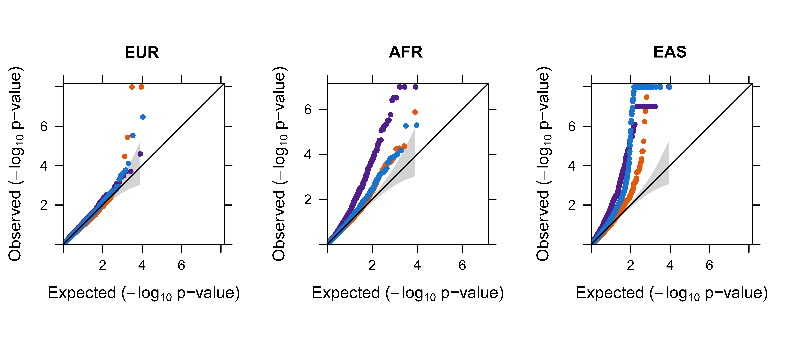
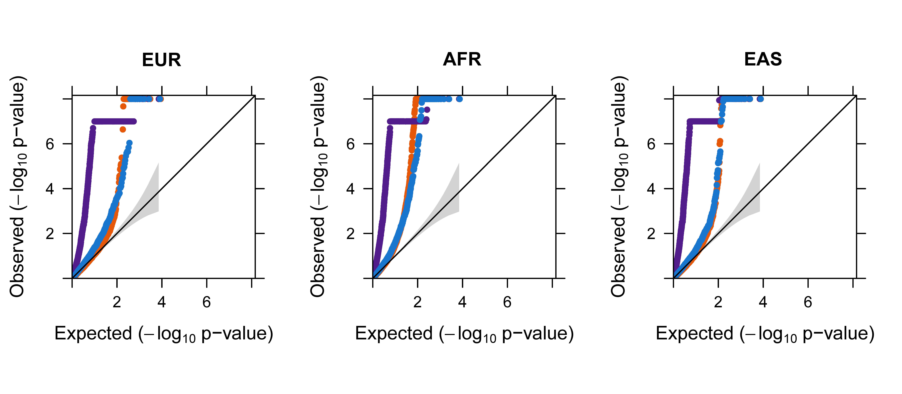
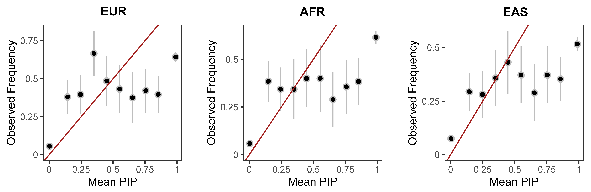

The summary statistics version of GIFT requires the LD matrix as inputs. We highly recommend to use in-sample LD matrix calculated using all samples in the data or use a randomly selected subsamples of the data (e.g. >10%) to construct the sub-sampled in-sample LD matrix. 

While GIFT can be easily paired with an LD matrix calculated from a reference panel that is different from the study sample (e.g., 1,000 Genomes project), we caution such use as this approach may produce moderately inflated p-values for GIFT due to LD matrix mis-match, just like what was observed for many other TWAS fine-mapping methods. 

To illustrate this issue, we performed a null simulation and an alternative simulation. In particular, we considered the null simulation setting where we set n1=465, n2=5,000, PVEzxi=10%, PVEzyi=0, for i=1,⋯,k; and the alternative simulation setting where we set PVEzyl=1% with l=1. In each setting, we carefully examined the impact of LD reference panel on analysis results by using LD correlation matrices constructed from different reference panels with varying similarity to the GWAS data. (1) In-sample LD: all individuals from the GWAS data (UK Biobank, n=5000); 50% of the individuals from the GWAS data (UK Biobank, n=2500); 20% of the individuals from the GWAS data (UK Biobank, n=1000); 10% of the individuals from the GWAS data (UK Biobank, n=500); 5% of the individuals from the GWAS data (UK Biobank, n=250); 1% of the individuals from the GWAS data (UK Biobank, n=50); (2) external reference panel: individuals of European ancestry (n=503) from the 1,000 Genomes project; individuals of African ancestry (n=661) from the 1,000 Genomes project; and individuals of Asian ancestry (n=504) from the 1,000 Genomes project. We paired each method with each of the reference panels for analysis. 

Below, we describe how to use these different LD matrices and what their results are. 

## In-sample LD
The in-sample LD matrix can be calculated either using all samples or estimated from a subset of the samples in the GWAS. We recommend use over 10% of individuals to calculate the in-sample LD matrix. To use an in-sample LD matrix, we set in_sample_LD = TRUE. 

### Null simulation results
GIFT provides well-calibrated p-values regardless which sub-sample LD matrix is used. As expected, the GIF (genomic control factor) of all methods increases with the proportion of individuals used in the LD matrix decreased.

| | GIFT |	FOGS |	MV-IWAS | 
|:------------------:|:-----------------:|:------------------:|:------------------:|
| 100% |	0.996 |	1.366 |	1.278 |
| 50% |	0.991 |	1.378 |	1.290 |
| 20% |	1.010 | 1.396 |	1.312 |
| 10% |	1.019 |	1.485 |	1.292 |
| 5% | 1.032 |	1.784 |	1.349 |
| 1% |	1.095 |	5.682 |	1.571 |

### Alternative simulation results
GIFT provides well-calibrated p-values for the null genes when the sub-sample LD matrix uses at least 10% of samples in the data. In contrast, FOGS and MV-IWAS produce inflated p-values. As expected, the GIF of all methods increases with the proportion of individuals used in the LD matrix decreased.

| | GIFT |	FOGS |	MV-IWAS | 
|:------------------:|:-----------------:|:------------------:|:------------------:|
| 100% |	1.045 |	3.813 |	1.610 |
| 50% |	1.026 |	6.131 |	1.574 |
| 20% |	1.073 | 6.283 |	1.654 |
| 10% |	1.073 |	6.877 |	1.777 |
| 5% | 1.235 |	8.303 |	1.904 |
| 1% |	1.709 |	24.535 |	2.860 |

The PIPs from FOCUS are not the calibrated either.

## External reference panel
Unfortunately, using an LD matrix constructed in a reference panel even with the same ancestry may lead to uncalibrated test statistics for all methods. The results also become less consistent with that obtained using an in-sample LD matrix when an external reference panel with European ancestries was used, and even less so when using an external reference panel with African or Asian ancestries. 

To use an external LD matrix, we set in_sample_LD = FALSE. Here, the external LD matrix is regularized in the form of (1-s1)\*Sigma1+s1*E and (1-s2)\*Sigma2+s2\*E, where both s1 and s2 are estimated by [estimate_s_rss](https://stephenslab.github.io/susieR/reference/estimate_s_rss.html) in susieR. A grid search algorithm is performed over the range from 0.1 to 1 once the estimation from susieR does not work well. 

### Null simulation results
All methods provide inflated p-values, although GIFT achieves the lowest GIF. The GIF obtained using the LD matrix from the European ancestries is also better than that obtained using African or Asian ancestries.

| | GIFT |	FOGS |	MV-IWAS | 
|:------------------:|:-----------------:|:------------------:|:------------------:|
| EUR |	1.035 |	1.507 |	1.275 |
| AFR |	1.062 |	1.715 |	1.318 |
| EAS |	1.135 | 2.438 |	1.456 |

### Alternative simulation results
Again, all methods provided inflated p-values, although GIFT achieved the lowest GIF. 
| | GIFT |	FOGS |	MV-IWAS | 
|:------------------:|:-----------------:|:------------------:|:------------------:|
| EUR |	1.291 |	7.544 |	1.732 |
| AFR |	1.536 |	11.284 |	1.763 |
| EAS |	1.214 | 13.276 |	1.516 |

The PIPs from FOCUS are also not calibrated when the LD matrix from the external reference panel is used.

