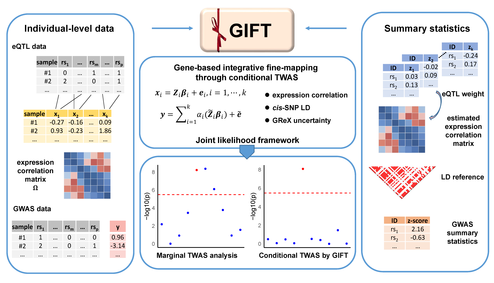

## GIFT Overview

GIFT is an R package for efficient statistical inference of conditional TWAS fine-mapping. GIFT examines one genomic region at a time, jointly models the GReX of all genes residing in the focal region, and carries out TWAS conditional analysis in a maximum likelihood framework. In the process, GIFT explicitly models the gene expression correlation and cis-SNP LD across different genes in the region, accounts for the uncertainty in the constructed GReX through joint inference and provides calibrated p values. GIFT is implemented as an open-source R package, freely available at www.xzlab.org/software.html. 

### Example Analysis with GIFT: [here](https://yuanzhongshang.github.io/GIFT/documentation/04_GIFT_Example.html).
